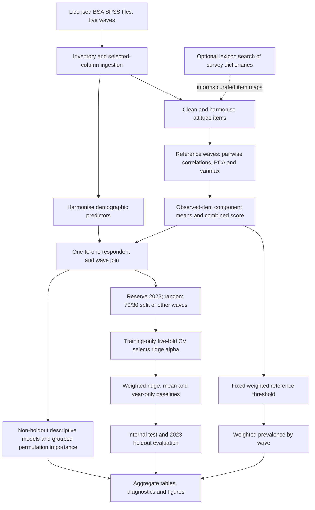

# Measuring and Predicting Right-Wing Populism in Britain

### A reproducible computational social science study of the post-2008 period

Can demographic and social characteristics predict a survey-based approximation of right-wing populist attitudes, and do the strongest associations persist across time? This project builds a Python pipeline that harmonises five **British Social Attitudes** waves, constructs an interpretable **PCA-informed attitude score**, and evaluates **survey-weighted ridge regression** against simple baselines. The technical challenge is making changing survey variables, missing responses and measurement choices explicit enough for a cross-wave comparison to be reproducible.

**19,477 source records · 17,615 analytical observations · 2011–2024 · 17 attitude items · 13 predictors**

BSc Computer Science dissertation by **Nicholas Suciu**, University of Sussex, 2026. The financial crisis motivates the research period; the empirical analysis begins in **2011**, with no pre-crisis comparison.

[Dissertation](dissertation/dissertation-public.pdf) · [Methodology](docs/methodology.md) · [Reproduction guide](docs/reproducibility.md) · [Figure gallery](docs/figures.md) · [Technical audit](docs/audit.md)

> **Research status:** all 11 submitted aggregate tables have been reproduced from the supplied local data. Two demographic recoding errors are corrected in a separate, evaluated profile. The submitted results below remain visible alongside the [correction results](docs/audit.md#b-analytical-corrections), which show slightly weaker prediction. The score is an attitudinal proxy, not a validated populism scale or a measure of party support.

## What the analysis finds


| Submitted ridge evaluation | Observations | Weighted R² | Weighted RMSE | Weighted MAE |
|---|---:|---:|---:|---:|
| Internal random test | 3,617 | 0.160 | 0.146 | 0.114 |
| Held-out 2023 wave | 5,559 | 0.143 | 0.169 | 0.133 |

Source: [saved regression metrics](outputs/main/tables/modelling/regression_metrics.csv). Ridge reduces internal-test weighted RMSE by **8.3%** against the weighted training-mean baseline. Predictions remain compressed toward the centre: their unweighted standard deviation is about **0.38 times** that of observed scores. Most variation is unexplained.

The holdout measures **transfer to another survey wave**. It is not a forward forecast: training includes 2011, 2013, 2019 **and 2024**. Predictors describe associations; the design does not identify causes.


The threshold is fitted once to the pooled non-holdout score distribution and applied across waves. These are shares above an analytical cutoff, **not estimates of how many people “are populists”**. Connecting lines join observed waves; no annual values or confidence intervals are estimated. [Underlying table](outputs/main/tables/trends/rwp_prevalence_by_year.csv).

Education has the largest grouped permutation importance in each of the four descriptive wave models, including in the separate correction run. This ranking is measured **in-sample**, and cross-wave education coding requires the caution explained in the audit. [All predictor comparisons](docs/figures/predictor-importance.png).

## Data and measurement

The five waves are **2011, 2013, 2019, 2023 and 2024**. BSA is a repeated cross-sectional survey: different respondents are sampled across years. Licensed source files and respondent-level derivatives are excluded from Git. See [data access and expected filenames](data/README.md).

| Constructed component | Retained items | Respondent scoring rule |
|---|---:|---|
| **Right** | 10 distrust, authoritarian and immigration items | Mean of observed 0–1 responses; at least 6 answered |
| **Welfare** | 7 welfare-attitude items | Mean of observed 0–1 responses; at least 5 answered |
| **`rwp_score`** | Available retained component scores | Equal mean of the available components, on a 0–1 scale |
| **`RWP_top_20`** | Derived score label | At or above the fixed weighted 80th percentile, approximately 0.67434 |

PCA with varimax rotation identifies item groups; **PCA factor scores are not the prediction target**. Items are oriented before scoring so that higher values follow the project's proposed construct. About 1.1% of the analytical sample receives a score from only one component. Item availability, missingness, pooling and the inclusion of welfare attitudes all constrain interpretation. [Retained item definitions](outputs/main/tables/measurement/measurement_items_final.csv).

## How the pipeline works



The modelling inputs are age, year, gender, education, income bands, class, region, religion, religiosity, ethnicity, tenure, employment status and marital status. The target's attitude items and threshold label are excluded from model predictors. Numeric imputation and categorical encoding are fitted inside each predictive training workflow. The submitted model retains unscaled age and year and selects **ridge α = 30** using five-fold CV within the training split, with seed **42**.

## Run it

Use **Python 3.11 or 3.12** from a source checkout. The captured reference environment is Python 3.11.14; dependencies are pinned.

```bash
python3.11 -m venv .venv
source .venv/bin/activate
python -m pip install -r requirements-lock.txt
python -m pip install --no-deps -e .

# No survey files needed: tests, saved-result figures and pipeline preview.
python -m unittest discover -s tests -v
python -m bsa_code.showcase
python run_all.py --dry-run

# With the five licensed survey files in place:
python run_all.py
python scripts/verify_results.py
```

A full run writes to **`outputs/reproduced/`**, preserving the submitted `outputs/main/` reference. Existing rerun outputs require an explicit `--overwrite`. The runner validates inputs before replacing output directories, records provenance and marks failures. To evaluate the documented corrections:

```bash
python run_all.py --config config/corrected.json
```

The [reproduction guide](docs/reproducibility.md) covers individual stages, Windows setup, optional dictionary discovery, data-free CI and the distinction between reproducing the submitted analysis and evaluating corrections.

## Repository map

```text
bsa_code/              Analytical modules and aggregate-only figure renderer
config/                Submitted settings, isolated rerun and correction profiles
raw_sav/               Local licensed inputs; ignored
data_dictionary/      Local survey dictionaries; ignored
outputs/main/          Frozen submitted aggregate tables and figures
outputs/reproduced/    Local rerun, intermediate data and provenance; ignored
data/README.md         Data access, variable names and source-file requirements
docs/                  Methods, reproduction, figures, audit and validation record
dissertation/          Privacy-edited reading edition and attribution
scripts/               Result comparison, publication checks and PDF preparation
tests/                 Data-free numerical and reproducibility contract tests
```

The existing package layout is retained to keep the pipeline recognisable. There are no notebooks in the submitted repository. The broader `config/waves/` catalogue supports earlier discovery work; it does not add waves to the final study.

## Limits and responsible use

- **Measurement:** repeated BSA items approximate part of right-wing populism. Reliability is not construct validity; the original “omega” calculation is a PCA-based heuristic, not a conventional omega estimator.
- **Validation:** the random test is independent for predictive model fitting, but measurement construction uses all non-holdout respondents, including that test subset. The 2023 wave is excluded from measurement fitting, threshold fitting and predictive training.
- **Comparability:** survey mode, question availability, age banding and demographic categories change over time. The correction profile addresses two verified recodes, not every comparability problem.
- **Uncertainty:** point estimates use survey weights, but the analysis does not implement full design-based uncertainty, measurement invariance tests or causal identification. Permutation repeat variability is not a sampling confidence interval.
- **Privacy and use:** broad associations cannot justify judging individuals or targeting political persuasion. Raw records, respondent scores and model objects remain private under the source data conditions.

## Technologies and citation

**Python · pandas · NumPy · scikit-learn · Matplotlib · PyReadStat · Apache Arrow/Parquet**

The project demonstrates survey metadata inspection, configuration-driven harmonisation, missing-data handling, unsupervised measurement construction, weighted model evaluation, temporal transfer testing and reproducible scientific communication.

Use [CITATION.cff](CITATION.cff) for the software citation. Cite the dissertation as: **Suciu, Nicholas (2026). _Machine Learning - Measuring and Predicting Right-Wing Populism in Britain Since the 2008 Financial Crisis_. BSc Computer Science dissertation, University of Sussex.** Cite each BSA data collection separately using its catalogue-provided citation and edition.

Code and repository documentation: [MIT licence](LICENSE). Dissertation and BSA materials retain their separate terms.
