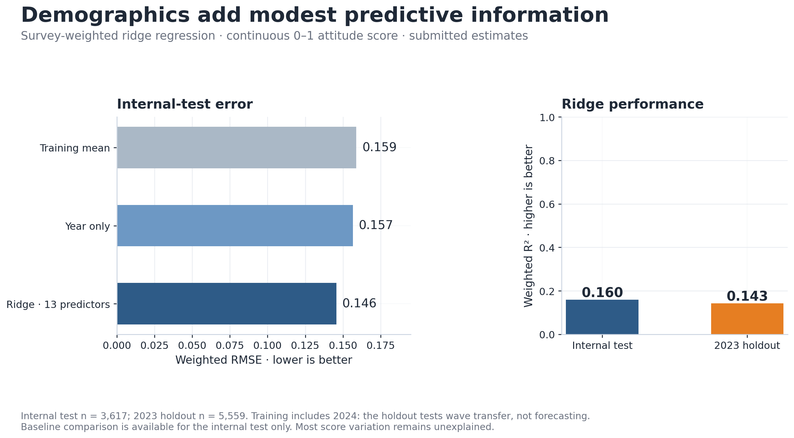
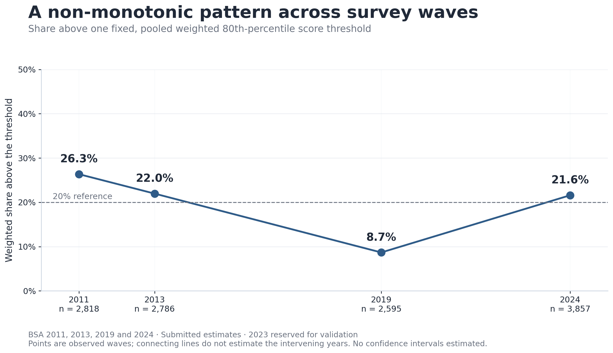
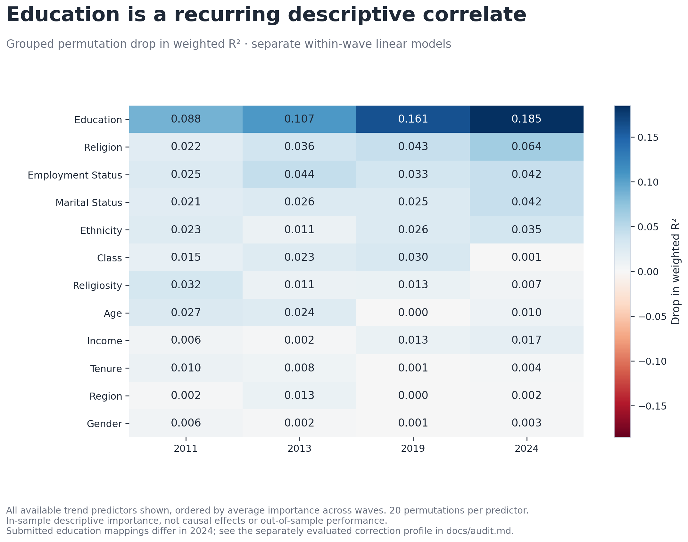

# Figure gallery

Three overview figures are rendered directly from the frozen aggregate CSVs, without access to licensed survey data:

```bash
python -m bsa_code.showcase
```

All overview estimates refer to the **submitted methodology**. Later corrections are quantified in [the audit](audit.md); they do not replace the original estimates or alter the dissertation PDF.

## Overview figures



**Prediction:** weighted ridge improves on internal-test mean and year-only baselines. The 2023 holdout is a wave-transfer test because training includes 2024. The full R² axis emphasises how much variation remains unexplained; errors are measured on the 0–1 score scale. Baseline comparisons are available only for the internal test.



**Threshold prevalence:** one reference cutoff is applied across years. Shares are 26.3%, 22.0%, 8.7% and 21.6%. These are not counts of people with a validated political identity. Year gaps are real; joining lines do not estimate annual values. No sampling confidence intervals are available.



**Descriptive associations:** all 12 trend predictors are shown, with year removed. Rows are ordered by average importance across the displayed waves. Values are in-sample weighted R² drops from 20 permutations, not causal effects or confidence levels. The original education recodes require caution, especially for the 2024 magnitude; education remains the strongest predictor in the separately corrected profile.

## Complete pipeline figure inventory

These 14 updated images are generated by the submitted-method rerun, using the shared plotting theme. The original 14 images remain in `outputs/main/figures/`. To refresh the public gallery after a successful local reproduction:

```bash
python run_all.py --overwrite
python scripts/update_gallery.py
```

The gallery updater first checks that all 11 aggregate tables match the submission reference; it does not promote a changed scientific result into the submitted-method gallery.

| Figure | Reading guide |
|---|---|
| [All-item correlations](figures/analysis/measurement/pca_correlation_matrix_rwp.png) | Unweighted pairwise Pearson correlations used for PCA. Diverging −1 to +1 scale preserves negative values; the upper triangle is masked to avoid duplication. |
| [Right-component correlations](figures/analysis/measurement/extras/pca_correlation_matrix_right.png) | Relationships within the 10-item component. These do not demonstrate that a single validated populism factor exists. |
| [Welfare-component correlations](figures/analysis/measurement/extras/pca_correlation_matrix_welfare.png) | Relationships within the seven-item welfare component, on the same scale. |
| [PCA scree plot](figures/analysis/measurement/pca_scree_rwp.png) | Leading 10 eigenvalue proportions and the elbow rule; two components are retained. |
| [Retained component summary](figures/analysis/measurement/measurement_component_summary_table.png) | Item counts and the 60% response rule. The final score averages observed component means. |
| [Retained question summary](figures/analysis/measurement/measurement_component_questions_table.png) | Short item labels and reference-wave availability. The CSV retains fuller machine-readable definitions. |
| [Observed versus predicted scores](figures/analysis/modelling/predicted_vs_actual.png) | Internal-test hexbin counts show compressed predictions. Colour is an unweighted respondent count, not a survey-weighted density or a confidence measure. |
| [Regression metrics](figures/analysis/modelling/regression_metrics_table.png) | Internal-test and held-out-wave metrics; blank cells mean unreported quantities, not zero. |
| [Threshold prevalence](figures/analysis/trends/rwp_prevalence_by_year.png) | Submitted threshold shares, excluding the holdout; the overview above adds sample sizes and interpretation. |
| [Selected predictor trends](figures/analysis/trends/predictor_trends.png) | Four predictors chosen by the original configuration, measured by grouped permutation R² drop in fitted wave models. The overview heatmap shows all predictors. |
| [Within-wave model fit](figures/analysis/trends/predictor_trend_model_fit_table.png) | In-sample weighted OLS fit; not the ridge model's out-of-sample performance. |
| [Education subgroup means](figures/analysis/trends/education_by_year_rwp.png) | Weighted mean score by harmonised education group. Read with the education correction findings. |
| [Employment subgroup means](figures/analysis/trends/employment_status_by_year_rwp.png) | Weighted group means; group sizes and omitted missing responses are recorded in the corresponding CSV. |
| [Religion subgroup means](figures/analysis/trends/religion_by_year_rwp.png) | Weighted group means, not an assessment of individuals or a causal religious effect. |

Subgroup figures share the full 0–1 outcome axis. Missing/other categories may be excluded by the original subgroup specification; group counts are in the saved tables. None of these figures supplies design-based uncertainty or makes a causal claim. The dissertation's embedded figures are preserved as submitted, even where the gallery improves their presentation.
